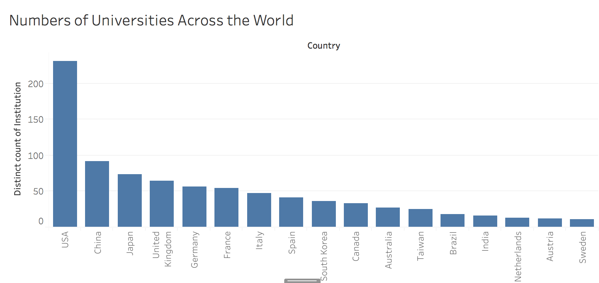
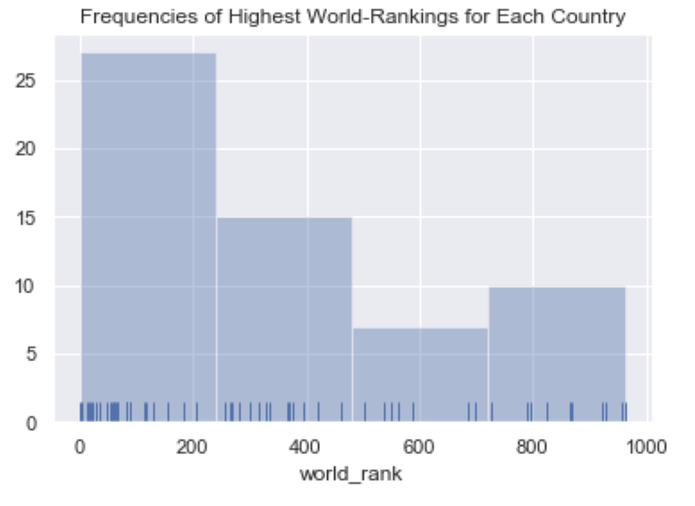
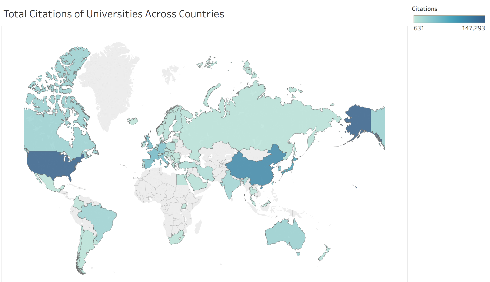
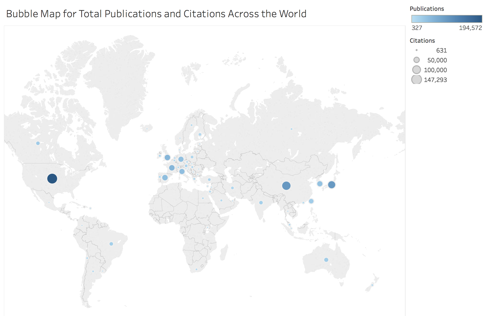
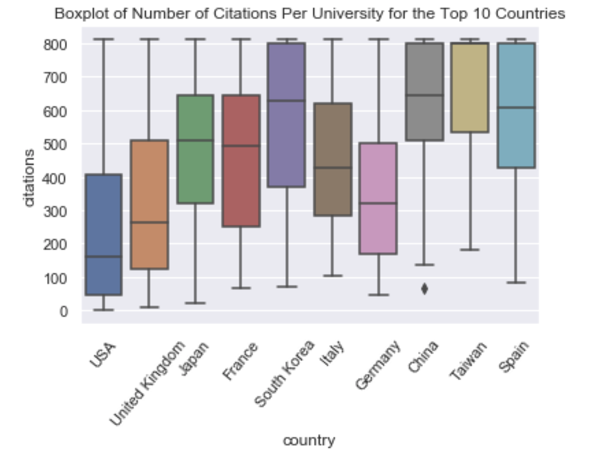
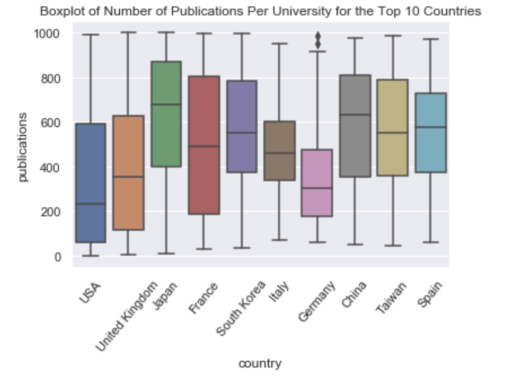
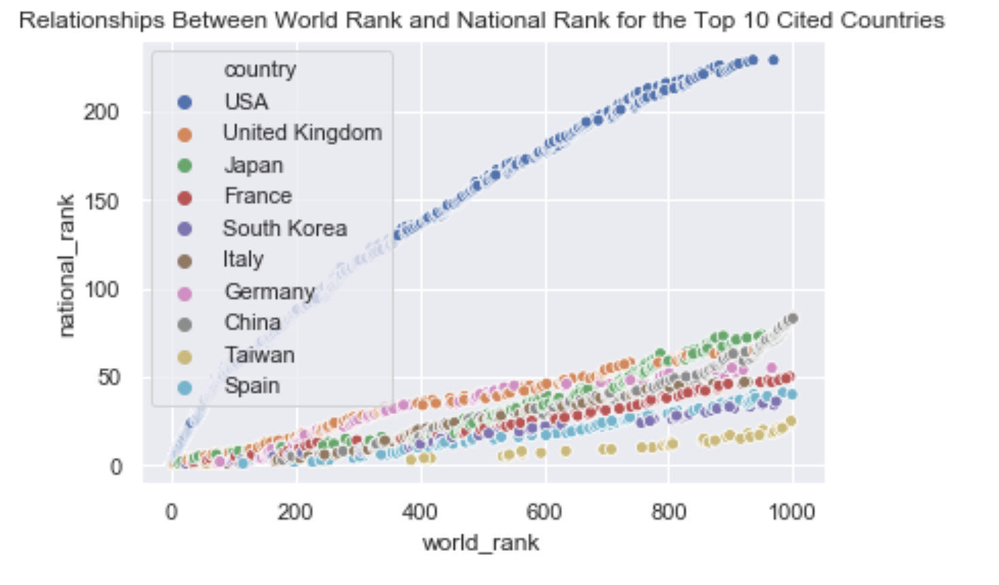
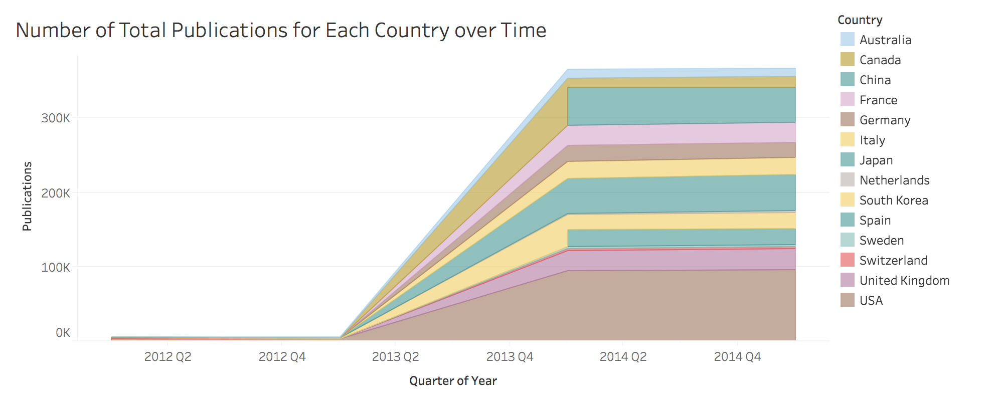
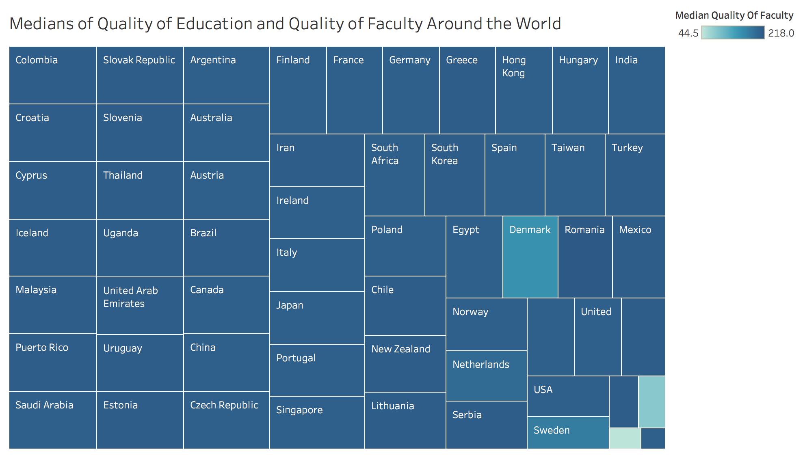

# Higher Education World University Rankin
The dataset is the Higher Education World University Ranking, which is widely regarded as one of the most influential and widely observed university measures.  
Founded in the United Kingdom in 2010. I got the data from the Kaggle competition(https://www.kaggle.com/mylesoneill/world-university-rankings). I chose this dataset because I’m interested in the rankings among universities across the world.   
I used to study in the top university in my country, but it is only ranked around 50~100th in the World University rankings. Now I’m studying at the University of San Francisco, which is a school that I 100% respect, but the world ranking for USF is probably some hundred away from the so-called “top schools”. I want to dig deeper in the dataset and see if there’s anything
interesting.   

Is there a pattern for higher-ranked schools in certain countries? Where are those high-ranked schools located? I want to answer these questions and discover more.  
The dataset contains some basic information of the ranked institutions: world rank, national rank, country, quality of education, quality_of_faculty,publications, citations and year.  
  
#### Let’s do some exploratory data analysis with visualizations:
  
Firstly, to understand how many institutions are there in the dataset, we plot the distinct number of universities in the dataset. We can see clearly that the number of universities in the USA is more than twice the number of China and all the rest of the world.  

  
Secondly, we inspect the frequencies of rankings for the top-ranked universities for each country. We can see that most countries have their top-ranked universities ranked within the top 200 in the world ranking. There are 10 countries with their top-ranked universities only ranked around 700-1000th in the world rank.  

  
Let’s take a look at the data in the map form. The first plot shows the total number of citations for each country across the world. We can see that the U.S., China, and Japan have more citations, as they have more institutions.  

  
We can also see from the bubble map that the U.S. apart from having the most citations, it also has the most publications in total.  

  

To get a better understanding of the statistics within each country, we select the top 10 countries with the highest total number of publications and check their statistics for each institution within that country. We can see that *even with the highest total number of publications for the whole country, the U.S. actually has the lowest mean of citations and publications for each institution*. From a glance of this plot, we get some feelings that *Japan and Korea are countries with higher total number of citations and a descent mean of citations and publications for each institution*.  

    
To see if there is a correlation between national rank and world rank, we plot the national ranks and world ranks for each institution and label them with colors corresponding to their countries. We can see that interestingly, the U.S. has a significantly larger slope than any other country in the plot.     

This stack graph shows how the total number of publication grows among countries over time.  

The treemap below shows that most countries share similar scores of quality of faculty and quality
 of education. This is an interactive plot so the quality of education is shown when moving the pointer
onto it.
  

## Conclusions
We can see some interesting insights from the above graphs:  
In terms of total amount, the U.S. is no doubt the world’s greatest power in education. For countries other than the U.S., one institution needs to be in the top 100 to be ranked in the world top 1000, whereas in the U.S., even the 200+th ranked institution can get into the top 1000 list. Even though that other countries might have a higher quality of education on average, the best schools are still in the U.S. That’s probably why we’re all here pursuing our American dream!

